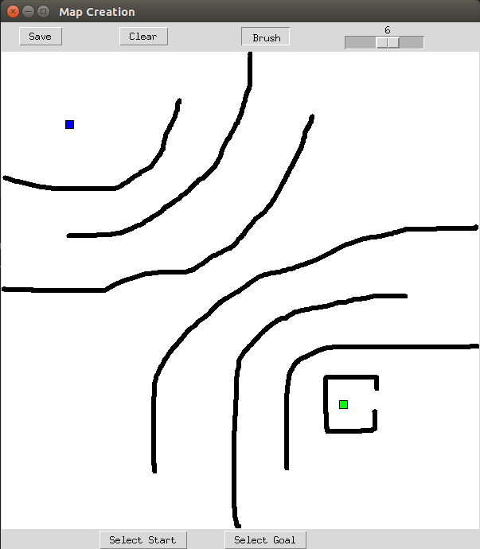
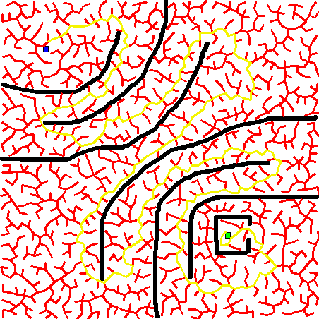

# RRT Path Generation

Uses Rapidly Exploring Random Trees (RRT) algorithm for 2D path planning.

## Map Creation  

Draw obstacles on a blank canvas using a python-based paint program. Clear button erases all of the obstacles drawn.

Use the buttons at the bottom for toggling between start and goal position selection. Once a button is pressed, right-click on the canvas to select position.

To run the mapping paint program:
~~~
python paint.py
~~~

## Path Generation

Generate a collision-free path from a start node to a goal node.

To compile the C++ program:
~~~
g++ -std=c++11 rrt.cpp -o rrt.out `pkg-config --libs opencv`
~~~

And run the resulting executable.
~~~
./rrt.out
~~~
